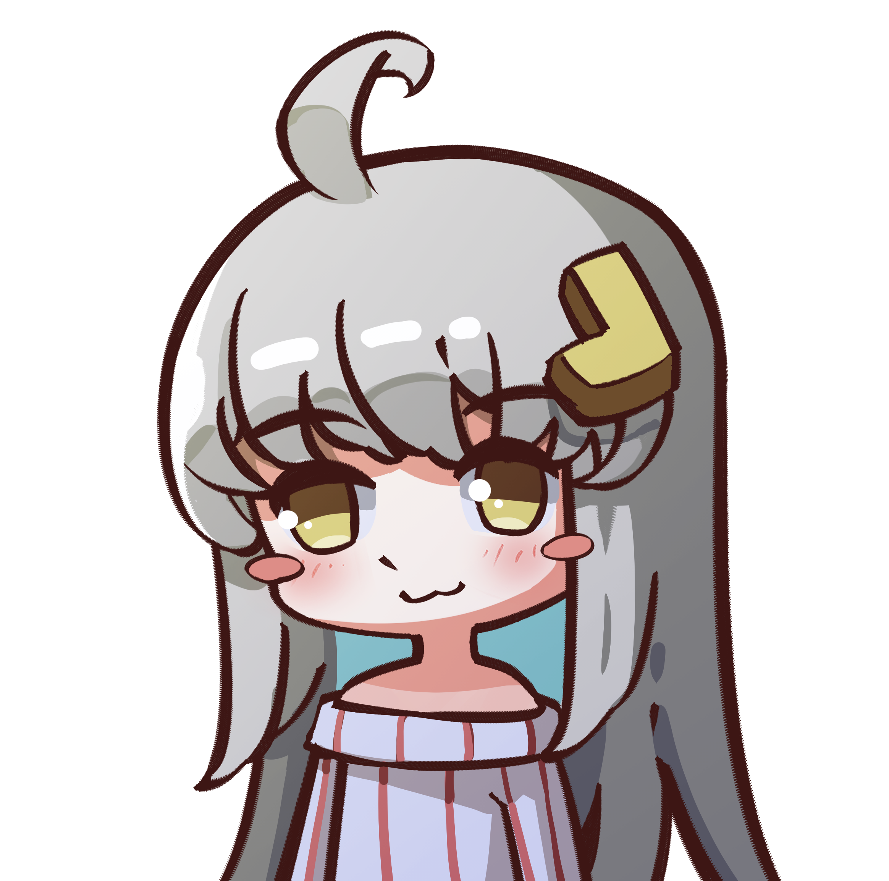
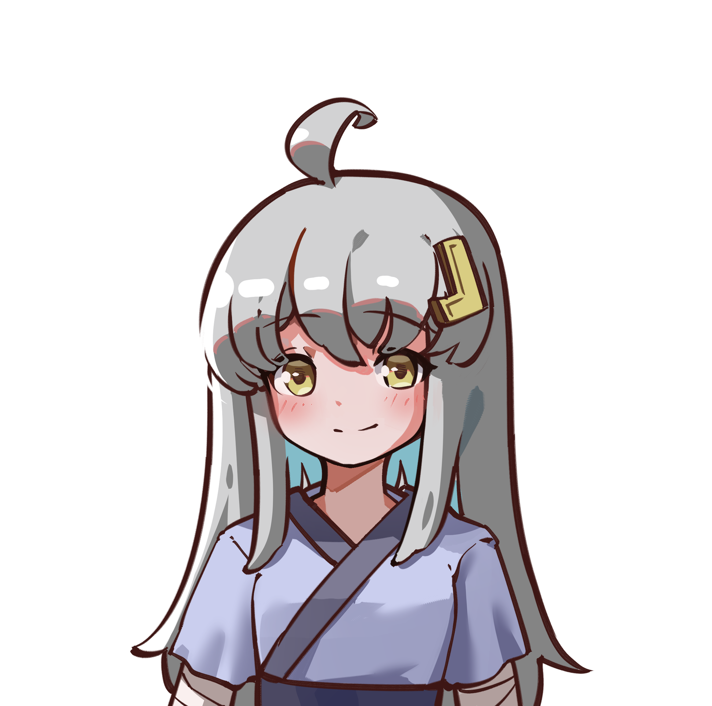
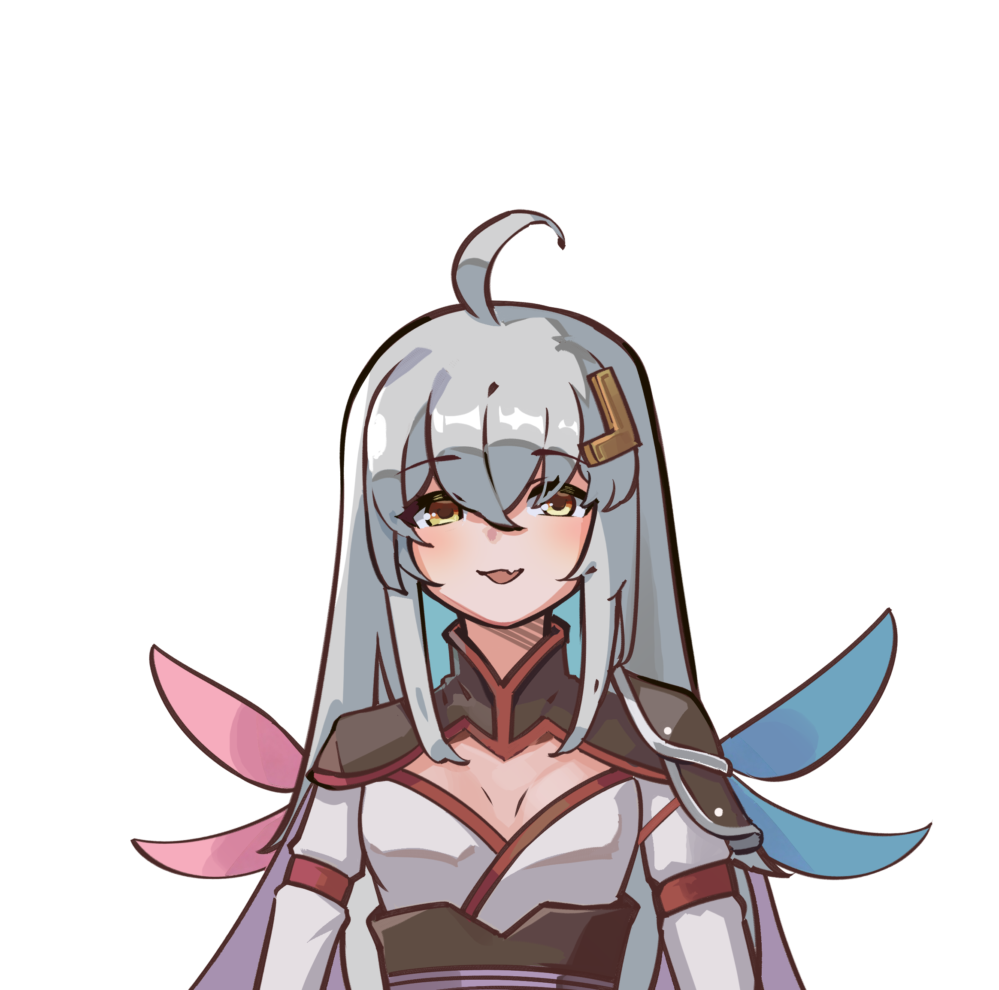
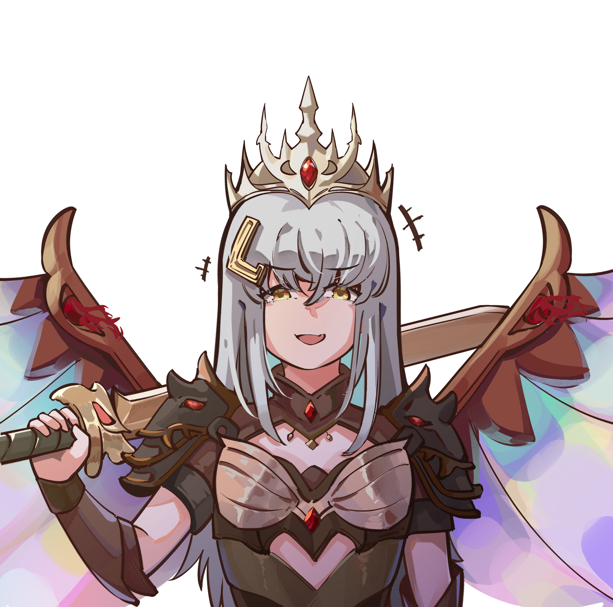
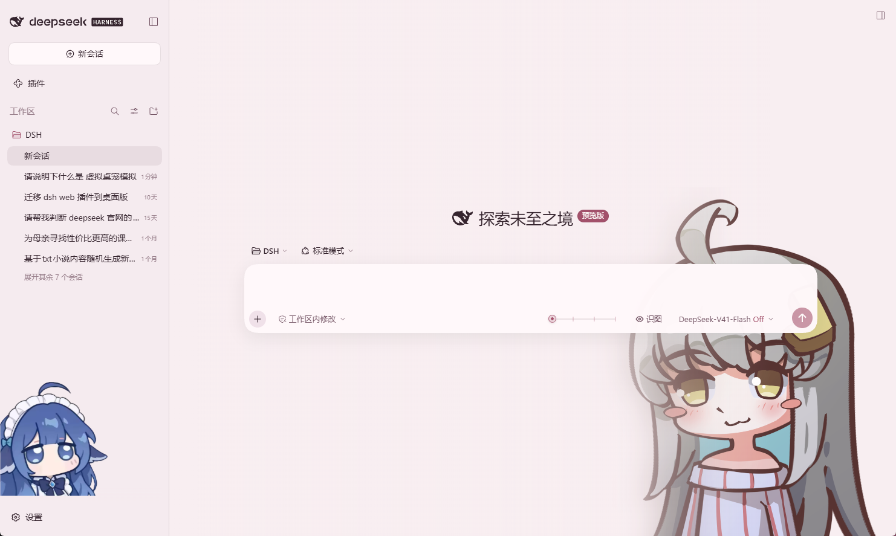
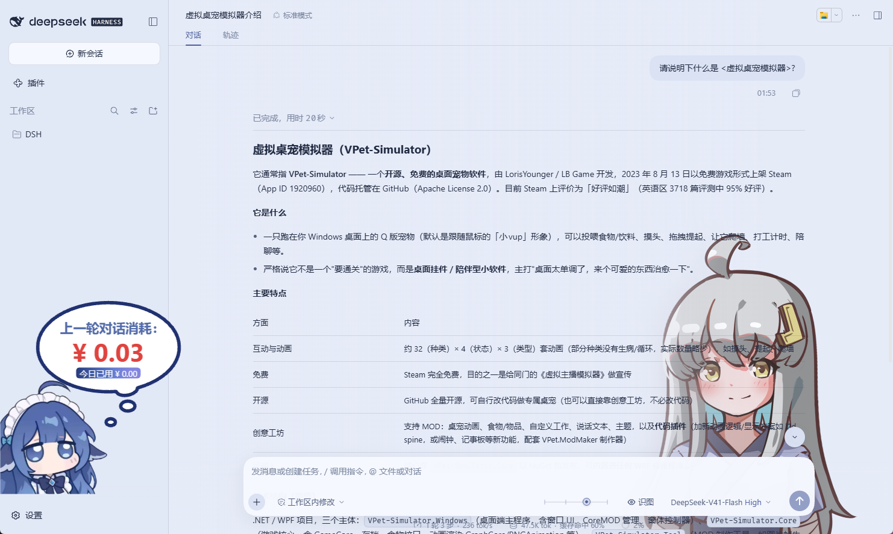

# VPet · DeepSeek Harness 皮肤

为 DeepSeek Harness 添加五种 VPet 萝莉斯 角色形态和对应配色。通过输入框旁的滑块切换形态，与模型的思考等级联动。

<p>
  
  
  
  
  
</p>




## 安装

```sh
dsh plugin --profile web add dsh-client-vpet-skin@latest
```

安装后重启 DSH Web

**Desktop 版本** 请在添加插件中写 `dsh-client-vpet-skin@latest`

## 使用

在 **设置 → 通用设置 → 外观** 中选择 **VPet** 启用皮肤；选择浅色、深色或跟随系统可停用。

- 拖动输入框旁的滑块，实时预览角色形态和配色。
- 开启 **VPet 绑定思考等级** 时，松开滑块会选择最近的模型档位。不支持思考等级或仅有一个档位的模型不显示滑块。
- 关闭绑定后，滑块独立控制皮肤，可自由选择全部五种形态。

## 本地开发

```sh
npm ci
npm run build
dsh plugin --profile web add .
```

修改源码后重新构建并重启 DSH Web。`npm pack` 可生成安装包。

## 素材与致谢

角色图片归 [虚拟桌宠模拟器制作组(VPet)](https://github.com/LorisYounger/VPet) 所有，画师：`OOZ` **二创允许**.

插件基于 [dsh-liang-skin](https://github.com/kingOfSoySauce/dsh-liang-skin) 修改。
